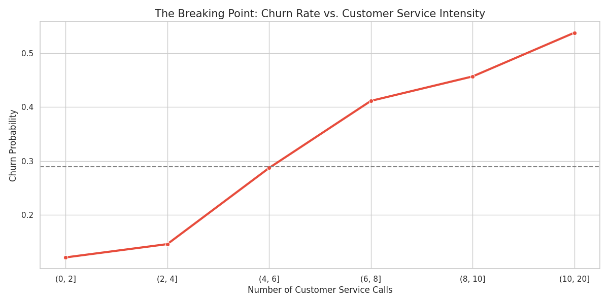
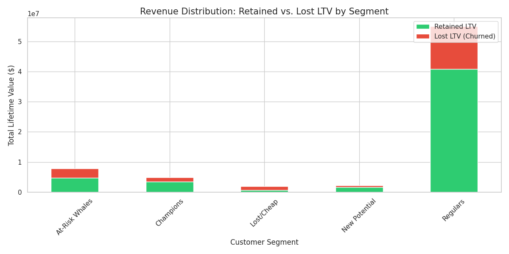
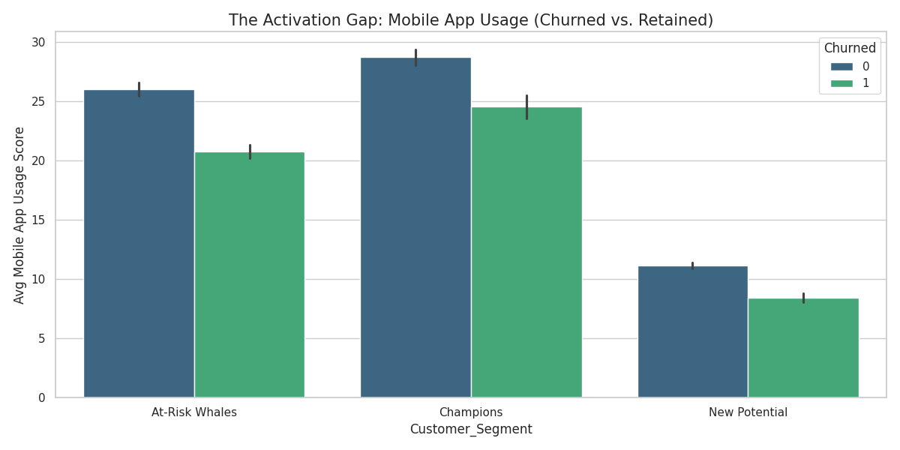

# E-Commerce Retention Strategy: LTV Optimization & Churn Analysis
**Persona:** Product Manager (Retention & Growth)  
**Impact:** Identified $20.6M in "At-Risk" Revenue and defined a 6-call friction threshold.

## 📌 Executive Summary
This project analyzes behavioral and transactional data from 50,000+ e-commerce users to identify why high-value customers churn. By using RFM segmentation and correlation analysis, I identified that churn is not driven by price, but by **service friction**. 

### Key Business Metrics:
* **Overall Churn Rate:** 28.9%
* **Total Revenue at Risk:** $20,597,365 (LTV)
* **AOV of Churned Users:** $134.76 (Higher than retained users)

---

## 📊 Key Insights

### 1. The "Breaking Point" (Service Friction)
Churn probability increases drastically once a customer reaches **6 service calls**. At this threshold, churn likelihood exceeds 40%.

### 2. The "At-Risk Whale" Segment
Using RFM Analysis, I identified that our highest-spending customers are "Quiet Churners." They don't call support; they simply stop logging in. 

### 3. The Activation Gap
New users with low Mobile App adoption are 3x more likely to churn within the first 90 days.

---

## 🛠 Strategic Roadmap (Proposed Interventions)

### Phase 1: Support Logic Refactoring (Short Term)
* **Priority Routing:** Flag users with >$130 AOV in the CRM to bypass basic support queues and reach Senior Agents.
* **Proactive Outreach:** Automate a "Service Recovery" credit for any user reaching their 4th support call to prevent them from hitting the "6-call breaking point."

### Phase 2: Mobile-First Activation (Mid Term)
* **Onboarding Pivot:** Shift new user "Welcome" sequences from Email (10% open rate) to SMS/Push-driven app downloads to improve early-stage retention.

---

## 💻 Tech Stack
* **Python:** Pandas, Matplotlib, Seaborn (EDA & Visualization)
* **Frameworks:** RFM Segmentation, Cohort Analysis
